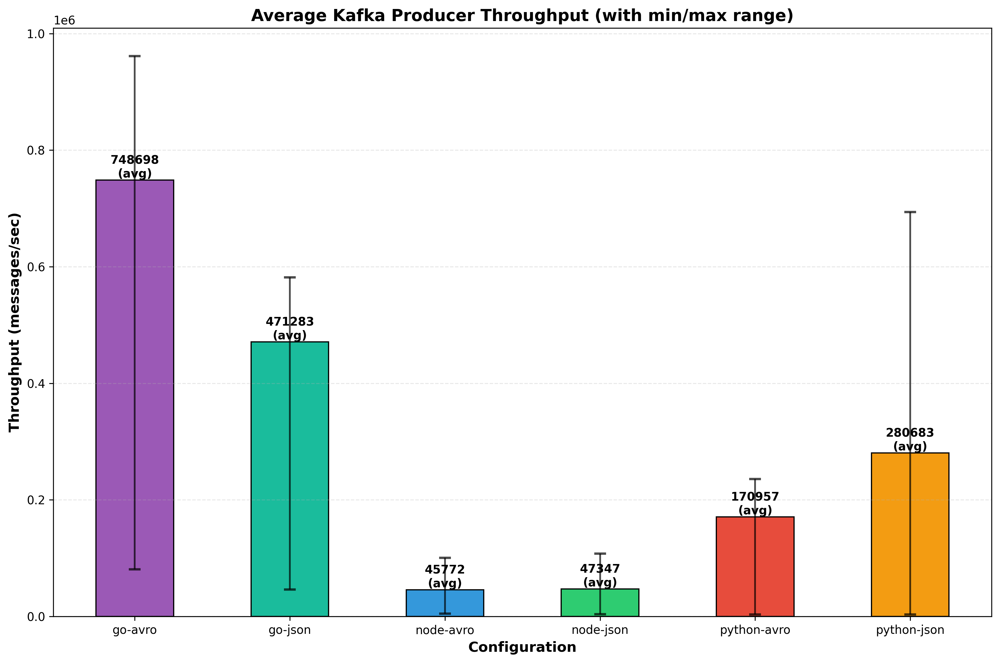
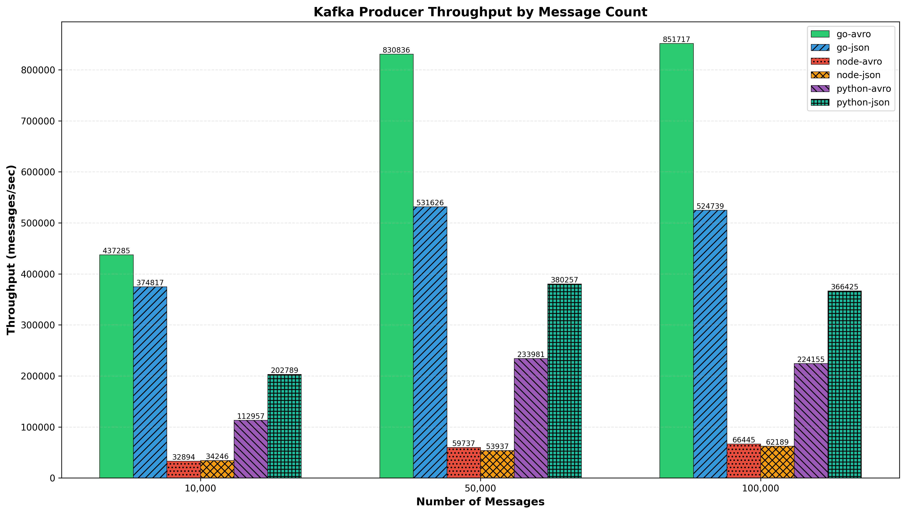

## Avro vs JSON Kafka Producer Benchmark

Benchmark producer throughput and overhead comparing JSON (with client-side compression and adjustable batching) vs Avro, in Node.js, Python, and Go.

### Prereqs
- Docker + Docker Compose
- Node.js 18+
- Python 3.10+
- Go 1.21+

### Quick start
```bash
# start Kafka and create topics
make up

# install deps
make node-install
make py-install
make go-build

# run benchmarks (Node/Python/Go x JSON/Avro)
make py-json
make py-avro
make node-json
make node-avro
make go-json
make go-avro

# or run comprehensive benchmark suite with visualizations
python run_benchmark_suite.py
```

Parameters (env/make vars):
- `MESSAGES` (default 100000)
- `BATCH` messages per send (default 100)
- `COMPRESSION` for JSON: `none|gzip|snappy|lz4` (default gzip).
- `BROKERS` (default `localhost:9094`)

Each run prints a single JSON line with summary metrics: `produced`, `durationSec`, `rate`, and effective parameters.

### Benchmark Suite

Run the complete benchmark suite with multiple configurations:
```bash
python run_benchmark_suite.py
```

This will generate performance comparison charts in the `results/` directory:
- Compression comparison (none, gzip, snappy)
- Batch size comparison (10, 50, 100, 500, 1000)
- Message count comparison (10k, 50k, 100k)
- Message size comparison (small vs large)
- Overall performance comparison

### Notes
- Topics: `bench-json` and `bench-avro`
- Avro schema: `schemas/event.avsc`
- Node uses `kafkajs` and `avsc`
- Python uses `confluent-kafka`, `orjson`, and `fastavro`
- Go uses `kafka-go` and `goavro`
- Results and charts are saved in `results/` directory

### Results

The benchmark suite generates several performance comparison charts:

#### Overall Performance Comparison

*Comprehensive performance comparison across all languages (Node.js, Python, Go) and formats (JSON, Avro) showing throughput rates and efficiency.*

#### Compression Comparison

*Performance impact of different compression algorithms (none, gzip, snappy, lz4) on JSON message throughput across all three languages.*

#### Batch Size Comparison

*Throughput analysis showing how different batch sizes (10, 50, 100, 500, 1000 messages) affect producer performance for JSON and Avro formats.*

#### Message Count Comparison

*Performance scaling analysis comparing throughput rates when producing different volumes of messages (10k, 50k, 100k) across all language and format combinations.*

#### Message Size Comparison

*Comparison of performance when handling small vs large message payloads, demonstrating how message size impacts throughput for different serialization formats.*

